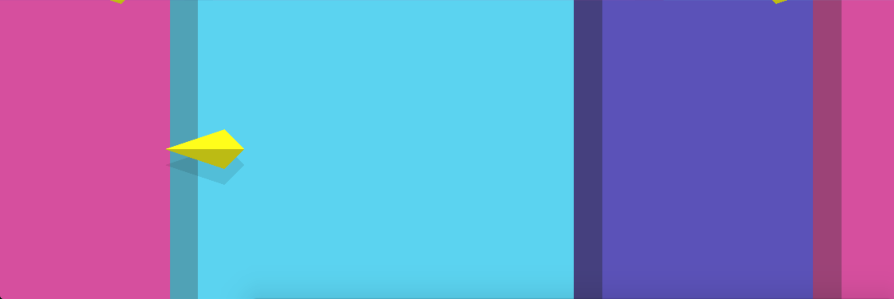

# THRUST

[Play THRUST](https://thrustgame.github.io/thrust) (you'll need a friend to play!)

## About

THRUST was made in about 48 hours,
during the Amabla Informal Game Jam in June 2016,
by Geoffrey Bachelet and Thomas Jarrand.

## Credits

OST: [Jumper by Killo-Gram](https://www.jamendo.com/track/1350213/jumper)

## Installation

Install dependencies

    npm install

Build the project

    gulp build

## Usage

Open `index.html` or serve the root directory over HTTP.

## License

MIT
